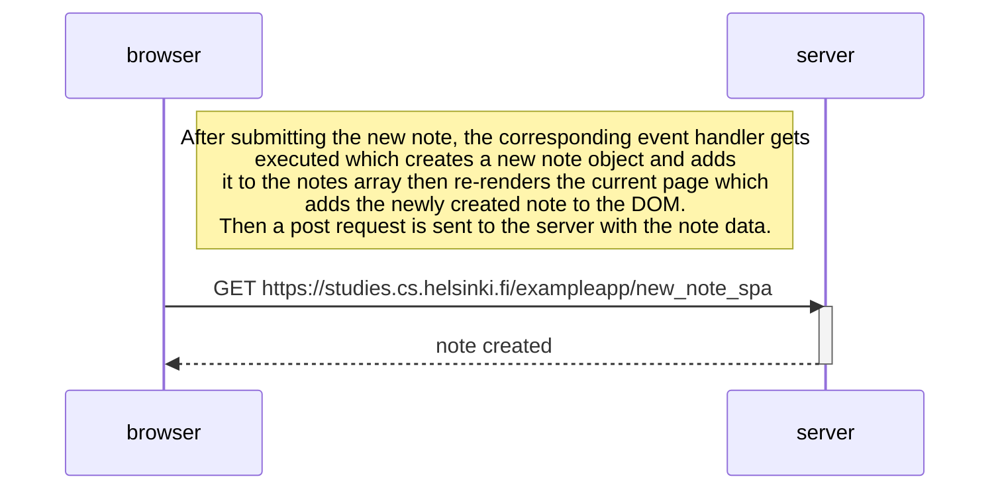

```mermaid

sequenceDiagram
    participant browser
    participant server

    Note right of browser: After submitting the new note, the corresponding event handler gets<br> executed which creates a new note object and adds<br> it to the notes array then re-renders the current page which<br> adds the newly created note to the DOM.<br> Then a post request is sent to the server with the note data.
    

    browser->>server: GET https://studies.cs.helsinki.fi/exampleapp/new_note_spa
    activate server
    server-->>browser: note created
    deactivate server

```